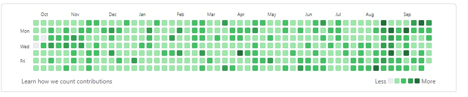
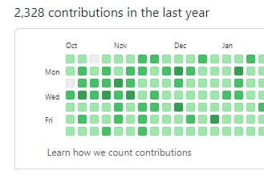

# Fix for missing contribution on Oct 18, 2020

GitHub somehow removed a contribution entry that was here before, probably as a source repository I pushed a PR to or made an issue in got
deleted.

Instead, here's a backdated commit that amounts to a contribution for this day to not be cheated out of a 365-day streak by GitHub.

## Proof

### 2021-10-01: 'soon', '360 days!!'

### 2021-10-04: 'now it's grayed out ._.'

